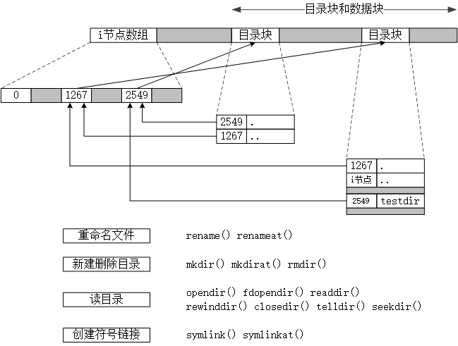

<h1 id=file_func>
    第04章 文件和目录
</h1>

[章节目录](../../README.md#title_ch04 "返回章节目录")
[笔记](notes.md "进入笔记")
[类型表](type.md "进入类型表")

<h2 id=table_stat>
    stat结构体成员及其相关的函数
</h2>

<table>
    <tr>
        <th>结构体(成员)</th>
        <th>说明</th>
        <th>分类</th>
        <th>函数</th>
    </tr>
    <tr>
        <td>struct stat;</td>
        <td>stat结构体</td>
        <td>获取stat结构体</td>
        <td>stat() fstat() lstat() fstatat()</td>
    </tr>
    <tr>
        <td rowspan="3">mode_t st_mode;</td>
        <td rowspan="3">文件类型和访问权限</td>
        <td>判断文件类型</td>
        <td>S_ISREG() S_ISDIR() S_ISCHR() S_ISBLK() S_ISFIFO() S_ISLINK() S_ISSOCK()</td>
    </tr>
    <tr>
        <td>测试访问权限</td>
        <td>access() faccessat()</td>
    </tr>
    <tr>
        <td>更改访问权限</td>
        <td>umask() chmod() fchmod() fchmodat()</td>
    </tr>
    <tr>
        <td rowspan="2">ino_t st_ino;</td>
        <td rowspan="2">i节点编号，stat结构体绝大部分信息来自i节点。</td>
        <td>创建指向i节点</td>
        <td>link() linkat()</td>
    </tr>
    <tr>
        <td>删除指向i节点</td>
        <td>unlink() unlinkat()</td>
    </tr>
    <tr>
        <td>dev_t st_dev;</td>
        <td>文件系统的设备号。</td>
        <td rowspan="2">获取主次设备号</td>
        <td rowspan="2">major() minor()</td>
    </tr>
    <tr>
        <td>dev_t st_rdev;</td>
        <td>针对特殊文件的设备号</td>
    </tr>
    <tr>
        <td>nlink_t st_nlink;</td>
        <td>链接计数，指向 st_ino 的目录项的个数。</td>
        <th>\</th>
        <th>\</th>
    </tr>
    <tr>
        <td>uid_t st_uid;</td>
        <td>用户ID</td>
        <td rowspan="2">更改所有者、所有组</td>
        <td rowspan="2">chown() fchown() fchownat() lchown()</td>
    </tr>
    <tr>
        <td>gid_t st_gid;</td>
        <td>组ID</td>
    </tr>
    <tr>
        <td>off_t st_size;</td>
        <td>以字节为单位的文件长度，只对普通文件、目录、符号链接有效。</td>
        <td>文件截断</td>
        <td>truncate() ftruncate()</td>
    </tr>
    <tr>
        <td>struct timespec st_atime;</td>
        <td>文件数据的最后修改时间。</td>
        <td rowspan="2">修改 atime mtime</td>
        <td rowspan="2">futimens() utimensat() utimes()</td>
    </tr>
    <tr>
        <td>struct timespec st_mtime;</td>
        <td>文件数据的最后修改时间。</td>
    </tr>
    <tr>
        <td>struct timespec st_ctime;</td>
        <td>文件属性的最后修改时间。</td>
        <th>\</th>
        <th>\</th>
    </tr>
    <tr>
        <td>blksize_t st_blksize;</td>
        <td>best I/O block size.</td>
        <th>\</th>
        <th>\</th>
    </tr>
    <tr>
        <td>blkcnt_t st_blocks;</td>
        <td>number of disk blocks allocated.</td>
        <th>\</th>
        <th>\</th>
    </tr>
</table>

<h2 id=table_dir>
    与目录块有关的函数
</h2>

<table>
    <tr><th>分类</th><th>函数</th></tr>
    <tr>
        <td>重命名文件</td>
        <td>rename() renameat()</td>
    </tr>
    <tr>
        <td>新建删除目录</td>
        <td>mkdir() mkdirat() rmdir()</td>
    </tr>
    <tr>
        <td rowspan="2">读目录</td>
        <td>opendir() fdopendir() readdir()</td>
    </tr>
    <tr>
        <td>rewinddir() closedir() relldir() seekdir()</td>
    </tr>
    <tr>
        <td>创建符号链接</td>
        <td>symlink() symlinkat()</td>
    </tr>
</table>

<h2 id=pic_ufs>
    UFS文件系统
</h2>

	

----

[章节目录](../../README.md#title_ch04 "返回章节目录")
[笔记](notes.md "进入笔记")
[类型表](type.md "进入类型表")