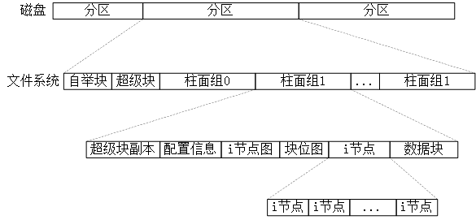

<h1 id=file_notes>
    第04章 文件和目录
</h1>

[章节目录](../../README.md#title_ch04 "返回章节目录")
[函数表](func.md "进入函数表")
[类型表](type.md "进入类型表")

---

<h2 id=ch_4.2>
    函数stat、fstat、fstatat、lstat
</h2>

```c
int stat(const char *pathname, struct stat *buf);
int fstat(int fd, struct stat *buf);
int lstat(const char *pathname, struct stat *buf);
int fstatat(int fd, const char *pathname, struct stat *buf, int flag);

头文件：sys/stat.h
功能：获取文件的信息结构。
返回值：若成功返回0，出错返回-1。
说明：
    stat()获取文件pathname的信息结构；
    如果文件是符号链接，lstat()将返回符号链接本身的信息，而不是指向的文件。
    fstat()返回在描述符fd上打开的文件的信息结构。

    fstatat() 返回相对于当前打开目录(fd)的路径名的信息结构。
    flag参数：AT_SYMLINK_NOFOLLOW被置位，返回符号链接本身的信息，而不是指向的文件。
    (1)pathname是绝对路径，忽略fd参数。
    (2)pathname是相对路径，开始地址是 fd 指向的目录。
    (3)pathname是相对路径，fd 参数等于 AT_FDCWD，开始地址是 当前工作目录。
示例代码：
```

<h2 id=ch_4.3>
    文件类型
</h2>

下表列出了UNIX系统的文件类型。文件类型存储在`stat`结构体中的`st_mode`成员中，可用下表中的宏`S_ISxxx()`来测试文件类型。将`st_mode`与宏`S_IFMT`位与，然后和宏`S_IFxxx`比较，也可以得到文件类型。即：

```c
#define S_ISDIR(mode)    (((mode) & S_IFMT) == S_IFDIR)
```

<table>
    <tr><th>文件类型</th><th>说明</th><th>宏</th></tr>
    <tr>
        <td>普通文件 regular file</td>
        <td>最常用的文件类型，包含了某种形式的数据。</td>
        <td>S_ISREG() S_IFREG</td>
    </tr>
    <tr>
        <td>目录文件 directory file</td>
        <td>包含了其他文件的名字以及指向这些文件有关信息的指针。</td>
        <td>S_ISDIR() S_IFDIR</td>
    </tr>
    <tr>
        <td>块特殊文件 block special file</td>
        <td>提供对设备带缓冲的访问，每次访问以固定长度进行。</td>
        <td>S_ISBLK() S_IFBLK</td>
    </tr>
    <tr>
        <td>字符特殊文件 character special file</td>
        <td>提供对设备不带缓冲的访问，每次访问长度可变。</td>
        <td>S_ISCHR() S_IFCHR</td>
    </tr>
    <tr>
        <td>FIFO</td>
        <td>用于进程间通信，有时也称为命名管道。</td>
        <td>S_ISFIFO() S_IFFIFO</td>
    </tr>
    <tr>
        <td>套接字 socket</td>
        <td>用于进程间的网络通信。</td>
        <td>S_ISSOCK() S_IFSOCK</td>
    </tr>
    <tr>
        <td>符号链接 symbolic link</td>
        <td>指向另一个文件。</td>
        <td>S_ISLNK() S_IFLNK</td>
    </tr>
</table>

<h2 id=ch_4.4>
    设置用户ID (SUID) 和设置组ID (SGID)
</h2>

与<font color="red"><b>进程</b></font>相关的ID。通常，<font color="red">有效用户ID</font>等于<font color="red">实际用户ID</font>；<font color="blue">有效组ID</font>等于<font color="blue">实际组ID</font>。

<b></b>

<table>
    <tr><th>ID</th><th>说明</th>
    <tr>
        <td><font color="red">实际用户ID</font></td>
        <td rowspan="2">实际上是谁，在登录时取自口令文件中的登录项</td>
    </tr>
    <tr><td><font color="blue">实际组ID</font></td></tr>
    <tr>
        <td><font color="red">有效用户ID</font></td>
        <td rowspan="3">用于文件访问检查</td>
    </tr>
    <tr><td><font color="blue">有效组ID</font></td></tr>
    <tr>
        <td>附属组ID</td>
    </tr>
    <tr>
        <td><font color="red">保存的设置用户ID</font></td>
        <td>有效用户ID的副本</td>
    </tr>
    <tr>
        <td><font color="blue">保存的设置组ID</font></td>
        <td>有效组ID的副本</td>
    </tr>
</table>

与<font color="red"><b>文件</b></font>相关的ID

文件所有者：`stat` 结构中的 `st_uid` \
文件所属组：`stat` 结构中的 `st_gid`

当执行一个文件时，(进程的)有效用户ID等于(登录用户的)实际用户ID。也就是说，与文件没有关系。如果文件的`设置用户ID（SUID）`置位，那么，(进程的)有效用户ID等于文件的所有者。

有效组ID也是类似的。

SUID 和 SGID 存储在 stat 结构体中的 st_mode 成员中。可用宏 S_ISUID() S_ISGID() 测试。

<h2 id=ch_4.5>
    文件访问权限
</h2>

`st_mode`包含了对文件的访问权限位，可用以下宏来测试。
<table>
    <tr>
        <th>st_mode屏蔽位</th><th>含义</th>
        <th>st_mode屏蔽位</th><th>含义</th>
        <th>st_mode屏蔽位</th><th>含义</th>
    </tr>
    <tr>
        <td>S_IRUSR</td><td>用户读</td>
        <td>S_IWUSR</td><td>用户写</td>
        <td>S_IXUSR</td><td>用户执行</td>
    </tr>
    <tr>
        <td>S_IRGRP</td><td>组读</td>
        <td>S_IWGRP</td><td>组写</td>
        <td>S_IXGRP</td><td>组执行</td>
    </tr>
    <tr>
        <td>S_IROTH</td><td>其他读</td>
        <td>S_IWOTH</td><td>其他写</td>
        <td>S_IXOTH</td><td>其他执行</td>
    </tr>
</table>

文件访问权限的规则：
1) 打开任一类型的文件，对该名字中包含的每一个目录，以及当前工作目录，都要有执行权限。
> 目录的读权限：获取该目录中所有文件名的列表 \
> 目录的执行权限：可通过该目录访问一个文件 \
> 如果PATH变量指定了一个不具有执行权限的目录，shell不会在此目录下寻找可执行文件
2) 文件的读权限：打开文件进行读操作。
> 与open 函数的 O_RDONLY 和 O_RDWR 标志有关。
3) 文件的写权限：打开文件进行写操作。
> 与open函数的 O_WRONLY 和 O_RDWR标志有关。
4) open 函数指定 O_TRUNC 标志时，必须具有写权限。
5) 在目录中创建一个文件，对所在目录必须有写权限和执行权限
6) 删除一个文件，对所在目录必须有写权限和执行权限，对文件本身不需要读写权限。
7) exec执行某个文件，必须有执行权限，且是一个普通文件。

文件权限的测试： \
进程打开、创建、删除一个文件时，内核会进行权限的测试。
测试过程涉及到文件的所有者(`st_uid`)、文件的所属组(`st_gid`)，
以及进程的`有效用户ID`和`有效组ID`。
1) 如果进程的`有效用户ID`是root，允许访问（忽略了文件的权限位）
2) 如果进程的`有效用户ID`和文件的`st_uid`相同，如果所有者适当的访问权限位打开，则允许访问。否则拒绝访问。
3) 如果进程的`有效组ID`和文件的`st_gid`相同，如果所属组适当的访问权限位打开，允许访问，否则拒绝。
4) 若其他用户的适当权限位被设置，允许访问，否则拒绝。
> 注：如果（2）测试失败，则（3）和（4）不会测试；其他类似。 \
> 适当的访问权限是指：若进程为读而打开该文件，则用户读位应为1。其他类似。

<h2 id=ch_4.6>
    新文件和目录的所有权
</h2>

新文件（目录）的所有者是进程的有效用户ID。 \
新文件（目录）的组ID可以是下列之一： \
1) 进程的有效组ID
2) 所在目录的组ID（可以做到向下传递权限）
> 对于Linux来说，如果目录的设置组ID位（`SGID`）被设置，则是(2)；否则(1)。

<h2 id=ch_4.7>
函数 access 和 faccessat
</h2>

```c
int access(const char *pathname, int mode);
int faccessat(int fd, const char *pathname, int mode, int flag);

头文件：unistd.h
功能：以进程的实际用户ID和实际组ID来测试访问权限。
      open()函数使用有效用户ID和有效组ID来测试。
返回值：成功(有权限)返回0，出错(没有权限)返回-1。
形参说明：
    pathname：测试文件的文件名
    mode：测试的权限，详细见下表。
    flag：更改 faccessat()的行为，如果取值为 AT_EACCESS，
          访问检查用进程的有效用户ID和有效组ID。
    fd：
        (1)pathname 为绝对路径，忽略此参数。
        (2)pathname 为相对路径，fd 指出起始目录。
        (3)pathname 为相对路径，fd 取值为 AT_FDCWD，起始目录为当前工作目录。
```

形参`mode`指明需要测试的权限，按以下常量位或：

<table>
    <tr><th>mode</th><th>说明</th><th>头文件</th></tr>
    <tr><td>R_OK</td><td>测试读权限</td><td rowspan="4">unistd.h</td></tr>
    <tr><td>W_OK</td><td>测试写权限</td></tr>
    <tr><td>X_OK</td><td>测试执行权限</td></tr>
    <tr><td>F_OK</td><td>测试文件是否存在</td></tr>
</table>

<h2 id=ch_4.8>
    函数 umask
</h2>

```c
mode_t umask(mode_t cmask);

头文件：sys/stat.h
功能：为进程设置文件模式创建屏蔽字，并返回之前的值。
返回值：之前的文件模式创建屏蔽字。
说明：
    cmask：由 S_IRUSER S_IWUSR 等常量按位或构成。
           umask 中为1的位，新建文件对应的权限一定被关闭。
```

> 在shell中，可用umask命令查看或设置文件模式创建屏蔽字。

<h2 id=ch_4.9>
    函数 chmod、fchmod、fchmodat
</h2>

```c
int chmod(const char *pathname, mode_t mode);
int fchmod(int fd, mode_t mode);
int fchmodat(int fd, const char *pathname, mode_t mode, int flag);

头文件：sys/stat.h
功能：更改现有文件的访问权限。
返回值：成功返回0，出错返回-1。
形参说明：
    pathname：文件名。
    mode：新的访问权限。下图所示常量的按位或。
    flag：取值为 AT_SYMLINK_NOFOLLOW时，不会跟随符号链接。

区别：
fchmod() 对已打开的文件进行操作。
fchmodat()：
           (1) pathname 为绝对路径，忽略fd参数。
           (2) pathname 为相对路径，fd 指出起始目录。
           (3) pathname 为相对路径，fd 取值为 AT_FDCWD，起始目录为当前工作目录。
```
> 为了改变一个文件的权限位，进程的`有效用户ID`必须等于`文件的所有者ID`或`root`。

<table>
    <tr><th>mode</th><th>说明</th></tr>
    <tr><td>S_ISUID</td><td>执行时设置用户ID</td></tr>
    <tr><td>S_ISGID</td><td></td>执行时设置组ID</tr>
    <tr><td>S_ISVTX</td><td></td>保存正文（粘着位）</tr>
    <tr><td></td><td></td></tr>
    <tr><td>S_IRWXU</td><td>用户读、写和执行</td></tr>
    <tr><td>S_IRUSR</td><td></td>用户读</tr>
    <tr><td>S_IWUSR</td><td></td>用户写</tr>
    <tr><td>S_IXUSR</td><td></td>用户执行</tr>
    <tr><td></td><td></td></tr>
    <tr><td>S_IRWXG</td><td>组读、写和执行</td></tr>
    <tr><td>S_IRGRP</td><td>组读</td></tr>
    <tr><td>S_IWGRP</td><td>组写</td></tr>
    <tr><td>S_IXGRP</td><td>组执行</td></tr>
    <tr><td></td><td></td></tr>
    <tr><td>S_IRWXO</td><td>其他读、写和执行</td></tr>
    <tr><td>S_IROTH</td><td>其他读</td></tr>
    <tr><td>S_IWOTH</td><td>其他写</td></tr>
    <tr><td>S_IXOTH</td><td>其他执行</td></tr>
</table>

`chmod()`将在下列条件自动清除两个权限位：
1) Solaris等系统，试图设置普通文件的S_ISVTX权限位，而没有root权限，那么S_ISVTX将会自动关闭。
2) 如果新文件的组ID不等于进程的有效组ID或者进程的附属组ID中的一个，而且进程没有root权限，那么S_ISGID会被自动关闭。
> 新创建文件的组ID可能是父目录的组ID。

<h2 id=ch_4.10>
    粘着位
</h2>

S_ISVTX，`粘着位`（sticky bit），也称为`保存正文位`（saved-text bit）。对于设置了`粘着位`的可执行文件或目录，有以下效果：
* 可执行文件
> 程序第一次被执行，在其终止时，程序正文部分的一个副本仍被保存在交换区。这使得下次执行该程序时能够较快的将其载入内存。
* 目录
> 只有对该目录有写权限，并且满足下列条件之一，才能删除或重命名该目录下的文件：
> * 拥有此文件
> * 拥有此目录
> * 是超级用户 
> 
> 典型应用：/tmp 目录。任何一个用户都可以在此目录创建文件，但是不能删除或重命名属于其他人的文件。

<h2 id=ch_4.11>
    函数 chown、fchown、fchownat 和 lchown
</h2>

```c
int chown(const char *pathname, uid_t owner, gid_t group);
int fchown(int fd, uid_t owner, git_t group);
int fchownat(int fd, const char *pathname, uid_t owner, git_t group, int flag);
int lchown(const char *pathname, uid_t owner, git_t group);

头文件：unistd.h
功能：更改文件的用户ID和组ID。
      若owner/group对应的取值为-1，表示不更改。
形参说明：
    pathname：文件名。
    owner：用户ID，若为-1，表示不更改。
    group：组ID，若为-1，表示不更改。

区别：
    fchown()在一个已打开的文件上操作，所以不能改变符号链接的uid/gid。
    lchown()更改符号链接本身的uid/gid。
    fchownat()：
        (1) pathname 是绝对路径，忽略参数fd。
        (2) pathname 是相对路径，fd参数指出起始目录。
        (3) pathname 是相对路径，fd参数是AT_FDCWD，起始目录是当前工作目录。
        flag：若设置了AT_SYMLINK_NOFOLLOW位，表示更改符号链接本身的uid/gid。
```

若_POSIX_CHOWN_RESTRICTED对指定的文件生效，则：
1) 只有超级用户进程能更改该文件的用户ID
2) 普通进程可以更改属于自己的文件的gid，但只能更改到进程的有效组ID或附属组ID。

非超级用户进程调用成功返回时，文件的设置用户ID位(`SUID`)设置组ID位(`SGID`)将被清除。


<h2 id=ch_4.12>
    文件长度
</h2>

* stat 结构成员 st_size 表示以字节为单位的文件长度。
> * st_size 只对普通文件、目录文件和符号链接有意义。
> * 普通文件：长度可以为0，在开始读取时，将得到文件结束标志（EOF）。
> * 目录文件：通常是一个数（16或512）的整数倍。
> * 符号链接：在文件名中的实际字节数。
> * 部分系统对管道也定义了文件长度，表示可从管道中读取的字节数。
* st_blksize：对文件IO较合适的块长度。
* st_blocks：所分配的实际512字节块块数。
> 并不是所有系统都是512B，此值是不可移植的。
* 文件中的空洞：设置的偏移量超过文件尾端，并写入某些数据后照成的。

查看文件大小的命令
* ls -l 以字节为单位
* du -s 以块为单位，一般情况下一块是512B
* wc -c 计算文件中的字符数

<h2 id=ch_4.13>
    文件截断
</h2>

```c
int truncate(const char *pathname, off_t length);
int ftruncate(int fd, off_t length);

头文件：unistd.h
功能：将文件的长度截断为length。
      如果length=0，可以在打开文件时指定 O_TRUNC 选项。
形参说明：
    pathname：
    fd：
    length：
说明：
length < old_length 文件缩小，超过 length 的部分将不可访问
length > old_length 文件增加，old_length 和 length 之间的数据读为0。
                    很有可能创建了一个空洞。
```

<h2 id=ch_4.14>
    文件系统
</h2>

<h3>磁盘、分区和文件系统</h3>

<div style="text-align:center">
	
</div>

* 磁盘
> * 磁盘可以有多个分区，每个分区有不同的文件系统。
> * 在一个分区中，有多个柱面。每个柱面，包含i节点数组、数据块、目录块。
* 数据块
> * 文件存储数据的地方
> * 一个文件可以有多个数据块
> * 一个数据块只能被一个文件所拥有
* 目录块
> * 存储目录文件数据的地方
> * 由`目录项`构成，`目录项`包含i节点编号和文件名
> * i节点编号可以理解为指向某个i节点，此i节点即为此目录下的文件。
> * 指向的i节点与目录块必须在同一个分区。
> * 有两个特殊的目录项：`.` 和 `..`。
* i节点
> * 包含了文件的大部分信息：文件类型、文件访问权限位、文件长度、指向文件数据块的指针。
> * 链接计数(st_nlink)：指向此i节点的目录项。减为0，才会删除该文件。

>> 由以上内容可以推出：
任何一个叶目录（不含任何文件）的链接计数总是2，
（1）命名该目录的目录项
（2）该目录中的 . 目录

<h3>UFS文件系统</h3>

<div style="text-align:center">
	
</div>

<h2 id=ch_4.15>
    函数link、linkat、unlink、unlinkat和remove
</h2>

```c
int link(const char *existingpath, const char *newpath);
int linkat(int efd, const char* existingpath, int nfd, const char*newpath, int flag);

头文件：unistd.h
功能：创建一个指向现有文件的链接。
      创建一个新目录项newpath，引用现有文件existingpath。
      existingpath所引用文件的链接计数加1。
      如果newpath已经存在，则返回出错。
返回值：成功返回0，出错返回-1。
形参说明：
    existingpath：现有目录项。
    newpath：新目录项。
    efd：
        (1) existingpath为绝对路径，忽略efd。
        (2) existingpath为相对路径，efd指明起始目录。
        (3) existingpath为相对路径，efd为AT_FDCWD，起始目录为当前工作目录。
    nfd：与efd类似。
    flag：(假设 existingpath 是个符号链接，且指向toppath)
        设置了 AT_SYMLINK_FOLLOW 标志
            newpath => toppath
            existingpath -> toppath
        没有设置 AT_SYMLINK_FOLLOW 标志
            newpath => existingpath -> toppath
        => 硬链接，两个文件的inode相同
        -> 软链接，两个文件的inode不同
限制：
(1) 无法跨文件系统
(2) 只有root可以创建指向目录的硬链接
```

```c
int unlink(const char* pathname);
int unlinkat(int fd, const char* pathname, int flag);

头文件：unistd.h
功能：删除目录项，并将由pathname所引用文件的链接计数减1。
      如果出错，不对该文件做任何更改。
返回值：成功返回0，出错返回-1。
形参说明：
    pathname：
        注：如果是符号链接，则删除符号链接本身，而不是指向的文件。
    fd：略
    flag：AT_REMOVEDIR 标志被设置时，unlinkat() 可以类似于rmdir()一样删除目录。
         否则和unlink()执行同样的操作。
权限要求：
对包含该目录项的目录具有写和执行权限。
如果目录设置了粘着位(S_ISVTX)，还要具备下列条件之一：
拥有该文件；或拥有该目录；或具有超级用户权限。
```

> 删除一个文件（inode）的条件：
> * 打开该文件的进程个数为0
> * 指向该文件(inode)的目录项为0，即链接计数为0

```c
int remove(const char *pathname);

头文件：stdio.h
功能：对于文件，remove() 的功能与 unlink() 相同
     对于目录，remove() 的功能与 redir() 相同
返回值：成功返回0，出错返回-1。
说明：
    此函数由 ISO C 说明。
    绝大多数非UNIX系统不支持文件链接。
```

<h2 id=ch_4.16>
    函数 rename 和 renameat
</h2>

```c
int rename(const char *oldname, const char *newname);
int renameat(int oldfd, const char *oldname, int newfd, const char *newname);

头文件：stdio.h
功能：对文件或目录重命名。
      ISO C对文件定义了rename() 函数，POSIX.1扩展了此标准，使其包含了目录和符号链接。
形参说明：
    oldname：
    newname：
    oldfd：
    newfd：
权限要求：
    对包含oldname及包含newname的目录具有写和执行权限。
```

* oldname是文件或符号链接
> 如果 newname 存在，`必须`不是一个目录。先将 newname 删除，然后将oldname重命名为 newname。
* oldname 是目录
> 如果 newname存在，`必须`是一个空目录。先将 newname 删除，然后将oldname重命名为 newname。 \
> newname 不能包含 oldname 作为路径前缀。不能将 /usr/foo 重命名为 /usr/foo/testdir。
* 如果 oldname 或 newname 引用符号链接，则处理的是符号链接本身，而不是引用的文件。
* 不能对 . 和 .. 重命名。
* 如果 oldname 和 newname 相同，不做任何更改，直接成功返回。

---

[章节目录](../../README.md#title_ch04 "返回章节目录")
[函数表](func.md "进入函数表")
[类型表](type.md "进入类型表")
