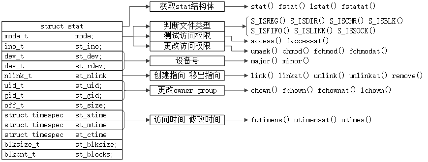

<h1 id=file_type>
    第04章 文件和目录
</h1>

[章节目录](../../README.md#title_ch04 "返回章节目录")
[笔记](notes.md "进入笔记")
[函数表](type.md "进入函数表")

---

<h2 id=type_struct_stat>
    结构体stat
</h2>

```c
struct stat{
    mode_t            st_mode;   /* file type & mode (permission) */
    ino_t             st_ino;    /* i-note number (servial number) */
    dev_t             st_dev;    /* device number (file system) */
    dev_t             st_rdev;   /* device number for special files */
    nlink_t           st_nlink;  /* number of links */
    uid_t             st_uid;    /* user ID of owner */
    gid_t             st_gid;    /* group ID of owner */
    off_t             st_size;   /* size in bytes, for regular files */
    struct timespec   st_atime;  /* time of last access */
    struct timespec   st_mtime;  /* time of last modification */
    struct timespec   st_ctime;  /* time of last file status change */
    blkszie_t         st_blksize;/* best I/O block size */
    blkcnt_t          st_blocks; /* bumber of disk blocks allocated */
};
```

<h2 id=pic_stat>
    stat结构体成员及其对应的函数
</h2>

<div style="text-align:center">
	
	<p>stat结构体成员及其对应的函数</p>
</div>

<h2 id=struct_timespec>
    结构体timespec
</h2>

至少包含以下两个字段：

```c
struct timespec {
    time_t tv_sec;
    long   tv_nsec;
};
```