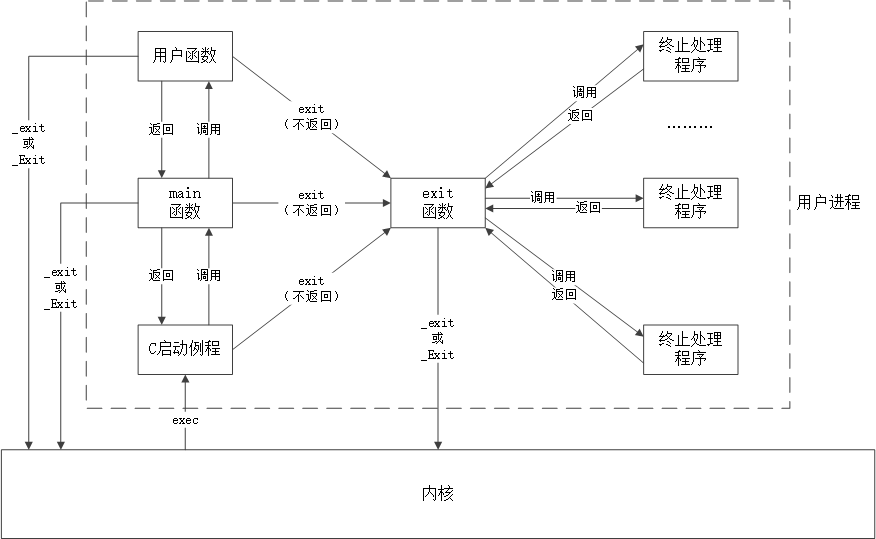
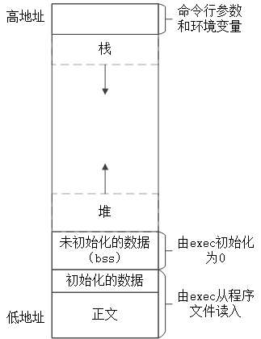

<h1 id=file_notes>
    第07章 进程环境
</h1>

[章节目录](../../README.md#title_ch07 "返回章节目录")
[函数表](func.md "进入函数表")

---

<h2 id=ch_7.1>
    main函数
</h2>

* 函数原型：`int main(int argc, char *argv[])`。
* argc 是命令行参数的个数，argv是指向参数的各个指针所构成的数组。
* mian函数在调用之前，内核会调用一个特殊的启动例程。
* 启动例程从内核取得命令行参数和环境变量值。

<h2 id=ch_7.3>
    进程终止
</h2>

进程终止的8种方法：
1) 从 mian 返回；
2) 调用 exit；
3) 调用 _exit 或 _Exit；
4) 最后一个线程从其启动例程返回；
5) 从最后一个线程调用 pthread_exit；
6) 调用 abort；
7) 接到一个信号；
8) 最后一个线程对取消请求做出响应。

<h3 id=func_exit>
    退出函数
</h3>

<table>
    <tr>
        <th>所属标准</th><th>函数原型</th>
        <th>头文件</th><th>说明</th>
    </tr>
    <tr>
        <td rowspan="2">ISO C</td>
        <td>void exit(int status);</td>
        <td rowspan="2">stdlib.h</td>
        <td>先执行一些清理动作，再调用 _Exit() 或 _exit</td>
    </tr>
    <tr>
        <td>void _Exit(int status)</td>
        <td rowspan="2">立即进入内核</td>
    </tr>
    <tr>
        <td>POSIX.1</td>
        <td>void _exit(int status)</td>
        <td>unistd.h</td>
    </tr>
</table>

形参`status`被称为`终止状态`。main()函数返回一个整型值与用该值调用 exit 是等价的。

<h3 id=func_atexit>
    函数atexit
</h3>

```c
int atexit(void (*func)(void));

头文件：stdlib.h
返回值：成功返回0，出错返回非0。
功能：登记终止处理程序。
```

关于`终止处理程序`的一些说明：
* 终止处理程序由 exit() 自动调用；
* 一个进程最多支持32个终止处理程序（可能有扩展）；
* exit 调用的顺序与登记的顺序相反。
* 同一个函数被登记多次，也会执行多次。

<h2 id=pic_c_progrm_start_and_exit>
    一个C程序是如何启动和终止的
</h2>

* 内核使程序执行的唯一方法是调用一个 exec 函数。
* 进程自愿终止的唯一方法是显式或隐式地调用_exit或_Exit。

<div style="text-align:center">
	
</div>

<h2 id=ch_7.4>
    命令行参数
</h2>

当执行一个程序时，调用exec的进程可将命令行参数传递给该新程序
* argv[0] 通常是程序名
* ISO C和POSIX.1都要求 argv[argc]是一个空指针
* 如果创建一个符号链接指向某一个程序。当执行符号链接时，argv[0]将会是符号链接的名字。busybox等工具的实现方式。

<h2 id=ch_7.5>
    环境表
</h2>

* 全局变量`environ`包含了环境表的地址。
```c
extern char **environ;
```
* 需要显示的使用 extern 声明此变量
* 按照惯例，环境变量由`name=value`这样的字符串组成。
* 通常使用 `getenv()` 和 `setenv()` 来访问特定的环境变量。
* 如果要查看所有的环境变量，则必须使用 environ 变量。

示例代码：<a href="code/test_environ.c">test_environ.c</a>

<h2 id=ch_7.6>
    C程序的存储空间布局
</h2>

C程序由下列几部分组成：
* 正文段，包含CPU执行的机器指令。可共享，只读。
* 初始化数据段，简称为数据段。
* 未初始化数据段bss（block start by symbol）。
* 栈，自动变量以及每次函数调用时所需保存的信息都放在此段中。
* 堆，通常在堆中进行动态存储分配。
* size命令可以查看程序文件的正文段、数据段和bss段的长度（字节为单位）

<div style="text-align:center">
	
</div>

<h2 id=ch_7.7>
    共享库
</h2>

优点：
* 共享库使得可执行文件不再需要包含公用的库函数。
* 减少了每个可执行文件的长度。
* 可以用库函数的新版本代替老版本而无需对使用该库的程序重新编译。
缺点：
* 增加了一些运行时间开销。

* gcc默认使用共享库，可使用 -static 选项阻止。
* 可以使用命令 objdump -x program | grep NEEDED 查看程序所需要的共享库。

<h2 id=ch_7.8>
    存储空间分配
</h2>

* malloc：分配指定字节数的存储区，初始值不确定。
* calloc：为指定数量、指定长度的对象分配存储空间。初始值为0。
* realloc：增加或减少以前分配的长度。当增加长度时，新增区域内的初始值不确定。
* free：释放以上函数分配的空间。

```c
头文件：stdlib.h
void *malloc(size_t size);
void *calloc(size_t nobj, size_t size);
void *realloc(void *ptr, size_t newsize);
    返回值：成功返回非空指针，失败返回NULL
void free(void *ptr);
```

* 返回的指针一定是适当对齐的，适用于任何数据结构。
* realloc的最后一个参数是存储区的新长度，而不是新、旧存储区长度之差。
* free释放的存储空间，通常被送入可用存储区池，可被再次分配。
* 大部分的实现不会减少进程的存储空间，释放的空间不返回给内核，而是保持在malloc池中。
* 大部分实现分配的存储空间比要求的大，额外的空间用来存放管理信息。

致命错误：
* 在动态分配的缓冲区前或后进行写操作。
* 释放一个已经释放了的块。
* 调用 free 时所用的指针不是3个alloc函数的返回值。
* 忘记调用free，造成内存泄漏。

<h2 id=ch_7.9>
    环境变量
</h2>

环境变量是`name=value`形式的字符串。内核不查看这些字符串，完全由应用程序解释。

```c
char *getenv(const char *name);

头文件：stdlib.h
返回值：指向与name关联的value的指针；若未找到，返回NULL。
功能：获取环境变量name的值。
```

常见环境变量：HOME LANG PATH PWD SHELL TZ等。

```c
头文件：stdlib.h

int putenv(char *str);
    返回值：成功返回0，出错返回-1。
    功能：设置环境变量。
int setenv(const char *name, const char *value, int rewrite);
    返回值：成功返回0，出错返回非0。
    功能：设置环境变量。
int unsetenv(const char *name);
    返回值：成功返回0，出错返回非0。
    功能：删除环境变量name。
```

* putenv 取形式为 name=value的字符串。如果name已经存在，则先删除其原来的定义。
  * putenv不会为str分配存储空间，直接将 str 放入环境表中。
  * 如果str是局部变量，很有可能会出错。
* setenv 将name设置为value。如果name已经存在：
  * rewrite = 0 ：不删除现有定义，value不更新，不出错。
  * rewrite = 1 ：删除现有定义。
  * setenv会复制name和value，并分配新的存储空间。
* unsetenv 删除name的定义，即使不存在也不算出错。

示例代码：<a href="code/test_getenv.c">test_getenv.c</a>


<h2 id=ch_7.10>
    函数setjmp和longjmp
</h2>

* 非局部goto，在栈上跳过若干调用帧，返回到当前`函数调用路径`上的某一个函数。
* 通常用于处理发生在很深层嵌套函数调用中的出错情况。

```c
#include <setjmp.h>
int setjmp(jmp_buf env);
    返回值：直接调用返回0；从longjmp返回，则为非0。
void longjmp(jmp_buf env, int val);

形参说明：
    env：存放在调用longjmp时能用来恢复栈状态的所有信息，通常定义为全局变量。
    val：setjmp的返回值。通过不同的值，可以判断出在不同的位置返回。
使用说明：
    在希望返回到的位置调用setjmp()，相当于设置一个锚点。
    在希望返回的位置，调用longjmp()，跳过多个栈帧。
```

longjmp()对变量取值的影响：
* 全局变量、静态变量（static）、易失变量（volatile）不受影响，在longjmp之后，它们的值是最近所呈现的值。
* 自动变量（局部变量）和寄存器变量（register）的值是不确定的。
* `声明自动变量的函数返回后，不能再引用这些自动变量。`

<h2 id=ch_7.11>
    函数getrlimit和setrlimit
</h2>

每个进程都有一些资源限制，其中一些可以使用getrlimit函数查询，setrlimit函数更改。

```c
#include <sys/resource.h>
int getrlimit(int resource, struct rlimit *rlptr);
int setrlimit(int resource, const struct rlimit *rlptr);

返回值：成功返回0，出错返回非0。
形参说明：
    resource：
    rlptr：

struct rlimit {
    rlim_t rlim_cur;    /* soft limit: current limit */
    rlim_t rlim_max;    /* hard limit: maximum value for rlim_cur */
};
```

一些说明：
* 任何一个进程可以将软限制值更改为小于或等于硬限制值。
* 任何一个进程可以降低硬限制值，但不能小于软限制值。
* 只有超级用户可以提高硬限制值。
* 资源限制影响到调用进程并由其之进程继承。
  * 所以bash内置ulimit命令，cshell内置limit命令。
* 常量 RLIM_INFINITY 指定了一个无限量的限制。

<table>
    <tr><th>资源</th><th>说明</th></tr>
    <tr>
        <td>RLIMIT_AS</td>
        <td>进程总的可用存储空间的最大长度（字节）。这影响到sbrk函数和mmap函数。</td>
    </tr>
    <tr>
        <td>RLIMIT_CORE</td>
        <td>core文件的最大字节数，若其值为0则阻止创建core文件。</td>
    </tr>
    <tr>
        <td>RLIMIT_CPU</td>
        <td>CPU时间的最大值（秒），当超过其软限制时，向该进程发送SIGXCPU信号。</td>
    </tr>
    <tr>
        <td>RLIMIT_DATA</td>
        <td>数据段的最大字节长度。初始化数据、非初始化及堆的总和。</td>
    </tr>
    <tr>
        <td>RLIMIT_FSIZE</td>
        <td>可以创建的文件的最大字节长度。当超过此软限制时，则向该进程发送SIGXFSZ信号。</td>
    </tr>
    <tr>
        <td>RLIMIT_MEMLOCK</td>
        <td>一个进程使用mlock能够锁定在存储空间中的最大字节长度。</td>
    </tr>
    <tr>
        <td>RLIMIT_MSGQUEUE</td>
        <td>进程为POSIX消息队列可分配的最大存储字节数。</td>
    </tr>
    <tr>
        <td>RLIMIT_NICE</td>
        <td>nice值可设置的最大限制。</td>
    </tr>
    <tr>
        <td>RLIMIT_NOFILE</td>
        <td>每个进程能打开的最多文件数。更改此限制将影响到sysconf函数在参数_SC_OPEN_MAX中返回的值。</td>
    </tr>
    <tr>
        <td>RLIMIT_NPROC</td>
        <td>每个实际用户ID可拥有的最大子进程数。更改此限制将影响到sysconf函数在参数_SC_CHILD_MAX中的返回值。</td>
    </tr>
    <tr>
        <td>RLIMIT_NPTS</td>
        <td>用户可同时打开的伪终端的最大数量。</td>
    </tr>
    <tr>
        <td>RLIMIT_RSS</td>
        <td>最大驻内存集字节长度（resident set size in bytes, RSS）。如果可用的物理内存非常少，则内核将从进程处取回超过RSS的部分。</td>
    </tr>
    <tr>
        <td>RLIMIT_SBSIZE</td>
        <td>在任一给定时刻，一个用户可以占用的套接字缓冲区的最大长度（字节）。</td>
    </tr>
    <tr>
        <td>RLIMIT_SIGPENDING</td>
        <td>一个进程可排队的信号最大数量。这个限制是sigqueue函数实施的。</td>
    </tr>
    <tr>
        <td>RLIMIT_STACK</td>
        <td>栈的最大字节长度。</td>
    </tr>
    <tr>
        <td>RLIMIT_SWAP</td>
        <td>用户可消耗的交换空间的最大字节数。</td>
    </tr>
    <tr>
        <td>RLIMIT_VMEM</td>
        <td>这是RLIMIT_AS的同义词。</td>
    </tr>
</table>

---

[章节目录](../../README.md#title_ch07 "返回章节目录")
[函数表](func.md "进入函数表")