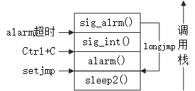

<h1 id=file_notes>
    第10章 信号
</h1>

[章节目录](../../README.md#title_ch10 "返回章节目录")
[函数表](func.md "进入函数表")

---

<h2 id=ch_10.2>
    信号概念
</h2>

* 信号是软中断，提供了一种处理异步事件的方法。
* 每个信号都有一个名字，以SIG开头。
* 信号被定义为一个`正整数`，即信号编号。可通过`kill -l`命令查看。
* 不存在编号为0的信号，POSIX.1将0称为空信号。

产生信号的条件：
* 当用户按某些终端键时，引发终端产生的信号。
> Delete, Ctrl+C, Ctrl+D
* 硬件异常产生信号，除数为0，无效的内存引用等。
* 进程调用kill函数将任意的信号值发送给另一个进程或进程组。
* 进程调用kill命令将信号发送给其他进程。
* 当检测到某种软条件发生时。

信号出现时的处理方式：
* 忽略此信号
> * SIGKILL 和 SIGSTOP不能被忽略。
> * 忽略硬件异常产生的信号，则进程的运行行为是未定义的。
* 捕捉信号，调用一个指定的用户函数。
* 执行系统默认动作。绝大多数信号的默认动作是终止进程。

常用信号及其产生条件：

<table>
    <tr><th>信号</th><th>产生条件</th></tr>
    <tr>
        <td>SIGABRT</td>
        <td>调用abort()函数产生此信号，进程异常终止。</td>
    </tr>
    <tr>
        <td>SIGALRM</td>
        <td>用alarm函数设置的定时器超时时，产生此信号。</td>
    </tr>
    <tr>
        <td>SIGBUS</td>
        <td>指示一个实现定义的硬件故障。</td>
    </tr>
    <tr>
        <td>SIGCHLD</td>
        <td>在一个进程终止或停止时，SIGCHLD信号被送给父进程。<br>
            注意，还有一个类似的信号SIGCLD（无H），具有不同的语义。</td>
    </tr>
    <tr>
        <td>SIGCONT</td>
        <td>此作业控制信号发送给需要继续运行，但当前处于停止状态的进程。</td>
    </tr>
    <tr>
        <td>SIGILL</td>
        <td>进程执行一条硬件非法指令。</td>
    </tr>
    <tr>
        <td>SIGINT</td>
        <td>用户按中断键时，终端驱动程序产生此信号并发送至前台进程组中的每一个进程。</td>
    </tr>
    <tr>
        <td>SIGKILL</td>
        <td>不能被捕捉或忽略，向系统管理员提供了一种可以杀死任一进程的可靠方法。</td>
    </tr>
    <tr>
        <td>SIGPIPE</td>
        <td>在管道的读进程已终止时写管道，则产生此信号。</td>
    </tr>
    <tr>
        <td>SIGQUIT</td>
        <td>当用户在终端上按退出键时，终端驱动程序产生此信号并发送给前台进程组中的所有进程。</td>
    </tr>
    <tr>
        <td>SIGSEGV</td>
        <td>进程进行了一次无效的内存引用。sementation violation。</td>
    </tr>
    <tr>
        <td>SIGSTOP</td>
        <td>不能被捕获或忽略。用于停止一个进程。</td>
    </tr>
    <tr>
        <td>SIGSYS</td>
        <td>无效的系统调用。</td>
    </tr>
    <tr>
        <td>SIGTSTP</td>
        <td>交互停止信号。用户在终端上按挂起键时，终端驱动程序产生此信号。</td>
    </tr>
    <tr>
        <td>SIGTTIN</td>
        <td>后台进程组尝试读终端时，终端驱动程序产生此信号。</td>
    </tr>
    <tr>
        <td>SIGTTOU</td>
        <td>后台进程组尝试写终端时，终端驱动程序产生此信号。</td>
    </tr>
</table>

<h2 id=ch_10.3>
    函数signal
</h2>

```c
#include <signal.h>
typedef void Sigfunc(int);
Sigfunc *signal(int signo, Sigfunc *func);
返回值：若成功，返回以前的信号处理方式；出错返回SIG_ERR。
功能：指定信号signo的处理方式func。
形参说明：
    signo：信号名。
    func：
        常量 SIG_IGN：忽略此信号。
        常量 SIG_DFL：系统默认动作。
        信号处理函数的地址：调用该函数
注意：
    signal的语义与实现有关，所以最好使用sigaction函数代替signal。
```

信号处理程序：返回值为void，带一个int类型的形参，其值为当前处理的信号。

signal需要改变信号的处理方式，才能确定型号的当前处理方式。而sigaction没有此限制。

exec调用：
* 将原先设置为要捕捉的信号都更改为默认动作。因为信号捕捉函数的地址在新程序中很可能无效。
fork调用：
* 子进程继承父进程的信号处理方式。因为信号捕捉函数的地址在子进程中是有意义的。

示例代码：<a href="code/test_signal.c">test_signal.c</a>

<h2 id=ch_10.4>
    不可靠信号
</h2>

在早期的UNIX实现中，信号是不可靠的，有以下几个问题：
* 信号可能会丢失。信号发生了，但是进程可能一直不知道。
* 对信号的控制能力很差。只能捕获或忽略信号，不能阻塞信号。
> 阻塞信号：不要忽略该信号，在其发生时记住它，然后在进程做好了准备时再通知它。
* 进程每次接到信号对其进行处理时，随即将该信号动作重置为默认值。
* 在进程不希望某种信号发生时，它不能关闭该信号。进程能做的一切就是忽略该信号。

<h2 id=ch_10.5>
    中断的系统调用
</h2>

如果进程在执行一个`低速系统调用`而阻塞期间捕捉到一个信号，则该系统调用就被中断不再继续执行。该系统调用返回出错，其errno设置为EINTR。

低速系统调用：可能会使进程永远阻塞的一类系统调用。
包括：
* 如果某类型文件的数据不存在，则读操作可能会使调用者永远阻塞。
* 如果数据不能被相同类型的文件立即接受，则写操作可能会使调用者永远阻塞。
* 在某种条件发生之前打开某些类型文件，可能会发生阻塞。
* pause()函数和wait() 函数。
* 某些ioctl操作。
* 某些进程间通信函数。

注意：读写磁盘的文件可能暂时阻塞调用者，除非发生硬件错误，IO操作总会很快完成。

如果write/read已经处理了部分数据，但此时被中断，有两种不同的语义：
1. 该系统调用失败，并将errno设置为EINTR。
2. 该系统调用成功返回，返回值是已经处理的数据量。

POSIX.1 选择的第2种。

出错处理：必须显式地处理出错返回。比如重启，或者其他什么的。

自动重启的系统调用：ioctl read readv write writev wait waitpid

sigaction可以控制信号的SA_RESTART标志，来决定被此信号中断的系统调用是否自动重启。

而对于signal建立的信号处理程序，是否自动重启，不同的实现不一样。Linux会自动重启。

<h2 id=ch_10.6>
    可重入函数
</h2>

* 重入：函数没有执行完成，由于外部的因素或内部调用，又一次进入该函数执行。
* 可重入：函数被重入后不会产生任何不良后果。

可重入函数的特点：
* 不使用任何（局部）静态或全局的非const变量。
* 不返回任何（局部）静态或全局的非const变量的指针。
* 仅依赖于调用方提供的参数
* 不依赖任何单个资源的锁。
* 不调用任何不可重入的函数。

可重入函数，又被称为`异步信号安全`。

可重入函数列表：见书。

常见不可重入函数：
* getpwnam 
* malloc / free
* 标准IO函数，printf等。
* longjmp siglongjmp

由于每个`线程`只有一个errno，信号处理程序很有可能改变errno。所以应当在信号处理程序的开始保存errno，结束后恢复。

在信号处理程序中调用一个非可重入函数，则其结果是不可预知的。

<h2 id=ch_10.7>
    SIGCLD语义
</h2>

SIGCHLD
* BSD的一个信号，POSIX.1采用此信号。
* 子进程状态改变后产生此信号，父进程需要调用一个wait函数以检测发生了什么。

SIGCLD（无H）
* System V的一个信号
* 如果SIGCLD设置为SIG_IGN，则调用进程的子进程将不产生僵尸进程。
* * 子进程在终止时，其状态将被丢弃。
* * 如果此时调用一个wait函数，则会一直阻塞，直到最后一个子进程终止，wait返回-1。
* * 注意：这与其默认动作（SIG_DFL）“忽略”不同。
* 如果将SIGCLD设置为捕捉，则内核立即检查是否有子进程准备好被等待，如果有，则立即调用SIGCLD处理程序。
* * 在[不可靠信号](#ch_10.4)一节中提到，调用信号处理程序时，会设置为默认动作。
* * 如果在信号处理程序的开头，又一次设置SIGCLD，则可能会造成SIGCLD处理程序调用多次。
* * 解决方法：调用wait函数后，再调用signal设置信号处理程序。

注意：同一个处理程序，使用不同的语义，可能会无法工作。所以务必了解所用系统SIGCHLD的语义。

<h2 id=ch_10.8>
    可靠信号术语和语义
</h2>

* `信号产生`：造成信号的事件发生。
  * 事件可以是硬件异常、软件条件、终端产生的信号、调用kill函数。
* `递送`：信号产生后，内核在进程表中以某种形式设置一个标志。
* `未决`：信号产生和递送之间的时间间隔。
* 进程可以选用`阻塞信号递送`。
  * 如果进程产生了一个阻塞信号，并且该信号的动作是系统默认动作或捕捉，则该进程将信号保持为`未决`状态。
  * 直到解除信号的阻塞，或者对信号的动作改为忽略。
* 内核在递送一个信号的时候，才决定对信号的处理方式。
  * 也就是说，在信号递送之前，可以随意的更改对信号的动作。
* `信号排队`：如果信号在被解除阻塞之前产生多次
  * 只递送一次：不对信号进行排队。
  * 递送多次：对信号进行排队。信号排队属于POSIX.1实时扩展，不是所有系统都支持。
* 多个信号同时递送给一个进程
  * POSIX.1没有规定这些信号的递送顺序。
  * POSIX.1建议，先递送与进程状态有关的信号。

<h2 id=ch_10.9>
    函数kill和raise
</h2>

```c
int kill(pid_t pid, int signo);
头文件：signal.h
功能：将信号发送给进程或进程组。
返回值：成功返回0，出错返回-1。

int raise(int signo);
功能：向进程自身发送信号。

kill(getpid(), signo); 等同于 raise(signo);
```

参数pid的说明如下：
* pid  > 0 : 将信号发送给进程ID为pid的进程。
* pid == 0 : 将信号发送给同一进程组的所有进程，如果有权限的话。
* pid  < 0 : 将信号发送给进程组ID等于|pid|，而且有权限向其发送信号的所有进程。
* pid == -1: 将信号发送给有权限发送的所有进程。
* 注：以上的`所有进程`均不含系统进程集中的进程，记录init进程。

kill(pid, 0);
* 仍执行正常的错误检查，但是不发送信号
* 常被用于检测进程是否存在。
* 如果进程不存在，则返回-1，errno设置为ESRCH。
* 注意，此测试不是原子操作。

调用kill为调用进程发送信号，而且此信号是不被阻塞的：
* 在kill返回之前，某个信号被传送至该进程。
* 这个信号，可能是signo，或者其他某个未决信号。

<h2 id=ch_10.10>
    函数alarm和pause
</h2>

```c
unsigned int alarm(unsigned int seconds);
头文件：unistd.h
返回值：0或以前设置的闹钟时间的剩余时间（单位：s）
功能：设置一个定时器，在将来的某个时刻，定时器会超时。
      定时器超时时，产生SIGALRM信号。其默认动作是终止进程。
seconds：产生信号SIGALRM需要的时间，单位：s。
```

注意点：
* 一个进程只有一个闹钟时间。
* 如果闹钟还未超时，又一次调用alarm，剩余时间作为返回值返回。闹钟时间被新值代替。
* 参数为0，则取消以前的闹钟时间，剩余时间作为返回值返回。
* 务必在调用alarm之前注册信号处理程序。

```c
int pause(void);
头文件：unistd.h
返回值：-1，errno设置为EINTR。
功能：使进程挂起直至捕捉到一个信号。
注意：执行了信号处理程序，并返回之后，pause()才返回。
```

*好好理解书中的示例*

[示例一：sleep1](code/sleep1.c)
* 更改了之前的alarm的设置，如果有的话。
  * 解决方法：检查alarm的返回值。
  * 小于本次调用alarm的参数，等待已有闹钟超时即可。
  * 大于本次调用alarm的参数，sleep1返回之前，重置闹钟。
* 修改了SIGALRM的设置。
  * 保存signal的返回值，在sleep1返回之前，重置原配置。
* alarm和pause之间有一个竞争条件：在一个繁忙的系统中，调用pause之前，alarm已经超时并调用信号处理程序。
  * 解决方法1：使用setjmp
  * 解决方法2：使用sigprocmask和sigsuspend

[示例二：sleep2](code/sleep2.c)

* 问题：涉及与其他信号的交互。
* 如果SIGALRM中断了某个其他信号处理程序，则调用longjmp会提早终止该信号处理程序。
* [test_sleep2.c](code/test_sleep2.c)的调用栈如下：
* 调用栈向上增长，左边是事件。
* 在5s钟内键入Ctrl+C，并且保证 sig_int() 执行的时间大于5s。
* 当定时器超时之后，sig_alrm()调用longjmp()，直接跳过了sig_int()的栈帧。



*思考：如何在编程中避免这一点？*

alarm还可以对可能阻塞的操作设置时间上限：
* 原理：利用alarm产生的信号，中断阻塞的系统调用。
* 注意alarm和系统调用之间的竞争。
* 对自动重启的系统调用，此方法无效。
* 也可以使用longjmp，但还是存在与其他信号交互的问题。

<h2 id=ch_10.11>
    信号集
</h2>

信号集：`sigset_t`，能表示多个信号的数据结构。

信号集处理函数：

<table>
    <tr><th>函数原型</th><th>功能</th><th>返回值</th></tr>
    <tr>
        <td>int sigemptyset(sigset_t *set);</td>
        <td>清除所有信号</td>
        <td rowspan="4">成功返回0，出错返回-1</td>
    </tr>
    <tr>
        <td>int sigfillset(sigset_t *set);</td>
        <td>添加所有信号</td>
    </tr>
    <tr>
        <td>int sigaddset(sigset_t *set, int signo);</td>
        <td>添加信号</td>
    </tr>
    <tr>
        <td>int sigdelset(sigset_t *set, int signo);</td>
        <td>删除信号</td>
    </tr>
    <tr>
        <td>int sigismember(sigset_t *set, int signo)l</td>
        <td>测试信号</td>
        <td>若真返回1，若假返回0</td>
    </tr>
</table>

注：
* 程序在使用信号集之前，务必使用sigemptyset()或sigfillset()初始化信号集。
* 若信号无效，而返回出错，并设置errno=EINVAL。

<h2 id=ch_10.12>
    函数sigprocmask
</h2>

信号屏蔽字：当前阻塞而不能递送给该进程的`信号集`。

```c
int sigprocmask(int how, cosnt sigset_t *set, sigset_t *oset);
头文件：signal.h
返回值：成功返回0，出错返回-1。
功能：检测、更改进程的信号屏蔽字。
```

形参说明：
* `oset`返回进程当前的信号屏蔽字，可以为空。
* 如果`set`为空，`how`将没有意义。
* `how`决定`set`参数如何解释，如下表：

how | set | 说明
- | - | -
SIG_BLOCK | 希望阻塞的附加信号 | 新的信号屏蔽字是当前信号屏蔽字和set的并集
SIG_UNBLOCK | 希望解除阻塞的信号 | 新的信号屏蔽字是当前信号屏蔽字和set补集的交集
SIG_SETMASK | 该进程新的信号屏蔽字 | 该进程新的信号屏蔽字

注：
* 调用sigprocmask后如果有处于未决、未阻塞的信号，在sigprocmask返回之前，至少将其中一个信号递送给进程。
* sigprocmask仅为单线程进程定义，多线程进程有其他的函数。

<h2 di=ch_10.13>
    函数sigpending
</h2>

```c
int sigpending(sigset_t *set);
头文件：signal.h
返回值：成功返回0，出错返回-1。
功能：返回调用进程阻塞，并且不能递送的信号集。
```

注意：
* sigpending()返回的信号集一定处于未决状态。
* sigprocmask()第三个参数返回的信号集，不一定处于未决状态。

<h2 id=ch_10.14>
    函数sigaction
</h2>

```c
int sigaction(int signo, const struct sigaction *act, struct sigaction oact);
头文件：signal.h
返回值：成功返回0，出错返回-1。
功能：检查、修改与指定信号相关联的处理动作。用于取代早期的signal函数。
形参说明：
    act：非空表示修改信号signo的动作。可以为空。
    ocat：非空表示获取信号signo的上一个动作。可以为空。
```

sigaction结构体：

```c
struct sigaction {
    void (*sa_handler)(int signo);
    void (*sa_sigaction)(int signo, siginfo_t *info, void* context);
    sigset_t sa_mask;
    int sa_flags;
};
```

* sa_handler: 包含一个信号处理程序的地址。
* sa_sigaction: 一个替代的信号处理程序，`info`是信号产生的原因，`context`是进程上下文。
> sa_handler 与 sa_sigaction 互斥，由sa_flags决定使用哪一个。
* sa_mask: 一个信号集，在调用信号处理程序之前，被加入到进程的信号屏蔽字；返回时恢复到原来的值。
* sa_flags: 指定对信号进行处理的各个选项。
> * SA_INTERRUPT 中断的系统调用不自动重启
> * SA_RESTSRT 中断的系统调用自动重启
> * SA_SIGINFO 使用 sa_sigaction，而不是sa_handler。
> * SA_NOCLDWAIT 终止的子进程不产生僵尸进程，内核丢弃终止状态。即早期的SIGCLD语义。

结构体 siginfo_t 包含了信号产生原因的有关信息：

```c
struct siginfo_t {
    int          si_signo;   /* signal number */
    int          si_errno;   /* if nonzero, errno value from errno.h */
    int          si_code;    /* additional info (depends on signal) */
    pid_t        si_pid;     /* sending process id */
    uid_t        si_uid;     /* sending process real user id */
    void        *si_addr;    /* address that caused the fault */
    int          si_status;  /* exit value or signal number */
    union sigval si_value;   /* application-specific value */
};

union sigval {
    int sival_int;
    void *sival_ptr;
};
```

* si_value: 应用程序在传递信号时，传递一个整型或者一个指针。
* SIGCHLD会设置 si_pid、si_status、si_uid。
* SIGBUS、SIGILL、SIGFPE、SIGSEGV会设置si_addr、si_errno。
  * si_addr包含造成故障的根源地址，可能不准确。
  * si_errno包含错误编号，对应于信号产生的条件，并由实现定义。
* si_code包含一些额外的信息，不同的信号取值不同，可由实现定义额外的值。
  * 具体请看[test_sigaction.c](code/test_sigaction.c)。

最后一个形参`context`可被强制转换为`ucontext_t`结构类型，该结构标识信号传递时进程的上下文。至少包含以下字段：

```c
struct ucontext_t {
    ucontext_t *uc_link;     /* pointer to context resumed when this context returens */
    sigset_t    uc_sigmask;  /* signals blocked when this context is active */
    stack_t     uc_stack;    /* stack used by this context */
    mcontext_t  uc_mcontext; /* machine-specific representation of saved context */
};

/* uc_stack字段描述了当前上下文使用的栈，至少包含以下字段 */
struct stack_t {
    void  *ss_sp;     /* stack base or pointer */
    size_t ss_size;   /* stack size */
    int    ss_flags;  /* flags */
};
```

几个注意的点：
* 除非特殊地要求老的不可靠语义，应当使用sigaction。
* sigaction()默认不重启被中断的系统调用，除非说明了SA_RESTART标志。

<h2 id=ch_10.15>
    函数sigsetjmp和siglongjmp
</h2>

当调用信号处理程序时，当前信号被自动加入到进程的信号屏蔽字。如果调用longjmp，而不是直接返回，信号屏蔽字可能不会恢复，取决于实现。在信号处理程序中进行非局部返回，应该使用siglongjmp。

```c
#include <setjmp.h>
int sigsetjmp(sigjmp_buf env, int savemask);
返回值：直接调用返回0；从siglongjmp调用返回，返回非0。
void siglongjmp(sigjmp_buf env, int val);
```

* savemask 非0，表示sigsetjmp在env中保存进程的当前信号屏蔽字。
* siglongjmp 从env中恢复保存的信号屏蔽字。

注意点：
* env必须被sigsetjmp初始化之后，才能调用siglongjmp。
* 可通过设置全局变量的方式，调用sigsetjmp之后设置全局变量，调用siglongjmp之前检测全局变量。

<h2 id=ch_10.16>
    函数sigsuspend
</h2>

信号屏蔽字的作用：
* 阻塞指定信号，保护不被信号中断的代码临界区。
* 解除指定信号的阻塞，等待指定的信号发生。

对于第二个作用，一个不太正确的实现方法是：sigprocmask解除阻塞后，立即调用pause。这存在一个隐藏的竞争条件，信号可能在sigprocmask之后，pause之前被发送到进程。对pause而言，这个信号就好像从来没有发生过一样。

解决方法：在一个原子操作中先恢复信号屏蔽字，然后使进程休眠。

```c
int sigsuspend(const sigset_t *sigmask);
头文件：signal.h
返回值：-1，并将errno设置为EINTR。
功能：进程的信号屏蔽字设置为sigmask指向的值，并挂起进程。
     捕捉到一个信号，并从信号处理程序返回，则sigsuspend返回。
     并且信号屏蔽字设置为调用sigsuspend之前的值。
```

示例：
* 保护临界区代码。
* 等待一个信号处理程序设置一个全局变量。
  * 全局变量最好使用`sig_atomic_t`类型。
* 用信号实现父、子进程之间的同步。
  * SIGUSR1用于父进程通知子进程，SIGSUR2用于子进程通知父进程。代码见 [test_sigsuspend.c](code/test_sigsuspend.c)。

如果希望在等待信号的时候，调用其他系统函数，并没有一个很好的解决方法。如果可以使用多线程，可以专门安排一个线程处理信号。

<h2 id=ch_10.17>
    函数abort
</h2>

```c
void abort(void);
头文件：stdlib.h
返回值：此函数不会返回。
功能：向调用进程发送SIGABRT信号，并使进程异常终止。
```

其他的一些细节：
* abort()不会理会进程对SIGABRT的阻塞和忽略。
* 进程捕捉SIGABRT的意图：在进程终止之前由其执行所需的清理操作。
* 信号处理程序返回之后，abort()仍然不会返回到其调用者。
* 信号处理程序不返回的方法是调用exit、_exit、_Exit、longjmp、siglongjmp。
* POSIX.1要求冲洗所有打开的标准I/O流，ISO C没有强制要求。

示例代码：
* POSIX.1 的[abort()](code/abort.c) 实现。
* 示例代码：[test_abort.c](code/test_abort.c)
  * 不从SIGABRT的处理程序返回，而是调用siglongjmp，验证调用进程是否会异常。

<h2 id=ch_10.18>
    函数system
</h2>

POSIX.1要求system()忽略SIGINT、SIGQUIT，阻塞SIGCHLD。理由如下：
* 阻塞SIGCHLD：system函数需要需要获取子进程的终止状态，并将其作为返回值。否则，system创建的子进程结束时，system的调用者可能会误以为自己创建的子进程结束了。
* 忽略SIGINT、SIGQUIT：这两个信号只应该发送给正在运行的程序。

符号信号要求的实现：[system.c](code/system.c)

system的返回值：
从实现来看，system的返回值是-1（出错）或wait返回的status，详情可以参考[第8.6节](../08/notes.md#ch_8.6)。

注：WIFEXITED(status)为真，且WEXITSTATUS(status)为0，表示执行成功。

wait返回的status有以下取值：
* normal termination, WIFEXITED
  * bit15-8: exit status(0-255), shell return value
  * bit7-0 : 0
* killed by signal, WIFSIGNALED
  * bit7   : core dumped flag
  * bit6-0 : termination signal (!=0)
* stopped by signal, WIFSTOPPED
  * bit15-8: stop signal
  * bit7-0 : 0x7F
* Continued by signal, WIFCONTINUED
  * bit15-0: 0xFFFF

注意：
* 使用system函数的程序，一定要正确地解释返回值。
* 如果直接调用fork exec 和 wait，则终止状态与调用system是不同的。

<h2 id=ch_10.19>
    函数sleep、nanosleep和clock_nanosleep
</h2>

```c
unsigned int sleep(unsined int seconds);
头文件：unistd.h
返回值：0或未休眠完的秒数
功能：使调用进程被挂起直到满足下面两个条件之一：
      1. 已经过了seconds所指定的墙上时钟时间。
      2. 调用进程捕捉到一个函数并从信号处理程序返回。
```

注：可以使用alarm()实现sleep()函数，但不是必要的，因为这两个函数之间可能相互影响。一般使用nanosleep()实现sleep()。

```c
int nanosleep(const struct timespec *reqtp, struct timespec *remtp);
头文件：time.h
返回值：若休眠到要求的时间，返回0；若出错，返回-1。
功能：与sleep()类似，但是提供了纳秒级别的精度。
形参说明：
    reqtp: 需要休眠的时间长度。
    remtp: 未休眠完的时间长度，可以为NULL。
```

注意：
* 如果系统不支持精确到纳秒，要求的时间就会取整。
* 结构体[struct timespec](../04/type.md#struct_timespec)的定义。

```c
int clock_nanosleep(clockid_t clock_id, int flags, 
                    cont struct timepsec *reqtp, struct timespec *remtp);
头文件：time.h
返回值：若休眠到要求的时间，返回0；若出错，返回错误码。
功能：使用相对于特定时钟的延迟时间来挂起调用进程。
形参说明：
    clock_id: 指定了计算延迟时间基于的时钟。
              CLOCK_REALTIME              实时系统时间
              CLOCK_MONOTONIC             不带负跳数的实时系统时间
              CLOCK_PROCESS_CPUTIME_ID    调用进程的CPU时间
              CLOCK_THREAD_CPUTIME_ID     调用线程的CPU时间
    flags: 控制延迟是相对的还是绝对的。
           0: 休眠时间是相对的，例如希望休眠的时间长度。
           TIMER_ABSTIME: 休眠时间是绝对的，例如希望休眠到某个特定的时间。
```

注：
* 使用绝对时间时，remtp参数没有使用。
* 调用 clock_nanosleep(CLOCK_REALTIME, 0, reqtp, remtp) 和调用 nanosleep(reqtp, remtp) 的效果是相同的，除了出错返回。
* 相对休眠时间会导致实际休眠时间比要求的长，绝对休眠时间好一些。

<h2 id=ch_10.20>
    函数sigqueue
</h2>

在大部分UNIX系统不对信号排队，在POSIX.1的实时扩展中，有些系统开始增加对信号排队的支持。

使用信号排队必须做以下几个操作：
* 使用sigaction()函数安装信号处理程序时指定SA_SIGINFO标志。
* 在 sigaction结构的sa_sigaction成员中提供信号处理程序。
* 使用sigqueue函数发送信号。

```C
int sigqueue(pid_t pid, int signo, const union sigval value);
头文件：signal.h
返回值：成功返回0，出错返回-1。
```

注意：
* sigqueue 只能把信号发送给单个进程。
* 信号不能被无限排队，最大值是SIGQUEUE_MAX。

用于应用程序的独立信号集：SIGRTMIN ~ SIGRTMAX 之间，包括这两个限制值。

示例代码：[test_sigqueue.c](code/test_sigqueue.c)

<h2 id=ch_10.21>
    作业控制信号
</h2>

以下六个信号与作业控制有关：

<table>
    <tr><th>信号</th><th>说明</th><th>产生条件</th></tr>
    <tr>
        <td>SIGCHLD</td>
        <td>子进程已停止或终止。</td>
        <td></td>
    </tr>
    <tr>
        <td>SIGCONT</td>
        <td>如何进程已停止，则使其继续运行。</td>
        <td>通知shell在前台或后台恢复运行一个作业时，shell向该作业的所有进程发送此信号。</td>
    </tr>
    <tr>
        <td>SIGSTOP</td>
        <td>停止信号（不能被忽略或捕捉。</td>
        <td></td>
    </tr>
    <tr>
        <td>SIGTSTP</td>
        <td>交互式停止信号。</td>
        <td>输入Ctrl+Z时，此信号送至前台进程组的所有进程。</td>
    </tr>
    <tr>
        <td>SIGTTIN</td>
        <td>后台进程组成员读控制终端。</td>
        <td></td>
    </tr>
    <tr>
        <td>SIGTTOU</td>
        <td>后天进程组成员写控制终端。</td>
        <td></td>
    </tr>
</table>

注：
* 作业控制信号之间有某些交互。
  * 产生停止信号（SIGTSTP、SIGSTOP、SIGTTIN、SIGTTOU）中的任何一个时，未决的SIGCONT信号就被丢弃。
  * 产生SIGCONT信号时，未决的停止信号就被丢弃。

<h2 id=ch_10.22>
    信号名和编号
</h2>

信号编号和信号名之间的映射方法：

1. 使用数组 sys_siglist，数组下标是信号编号，数组中的元素是指向信号名字符串的指针。

```c
extern char *sys_siglist[];
```

2. psignal函数可移植地打印与信号编号对应的字符串，与perror类似。 
```c

void psignal(int signo, const char *msg);
头文件：signal.h
功能：打印msg和信号说明到标准错误。
```

3. 在sigaction信号处理程序中，打印siginfo结构。

```c
void psiginfo(const siginfo_t *info, const char *msg);
头文件：signal.h
功能：打印msg和siginfo_t的说明到标准错误。
```

4. strsignal只获取信号的字符描述部分，与strerror类似。

```c
char *strsignal(int signo);
头文件：string.h
返回值：指向描述该信号的字符串的指针。若信号不存在，不同的实现行为不一样。
```

5. 一对信号编号和信号名的映射函数，在交互式程序中有用。

```c
int sig2str(int signo, char *str);
int str2sig(const char *str, int *signop);
头文件：signal.h
返回值：成功返回0，出错返回-1。
注意：
    信号转字符串，必须提供足够大的缓冲区，包括NULL字节。建议使用常量SIG2STR_MAX。
    转换之后的信号不带SIG。例如SIGKILL翻译为KILL。

    字符串转信号，需提供不带SIG的信号名称，或十进制信号编号的字符串。
```

示例代码：[test_signo.c](code/test_signo.c)

---

[章节目录](../../README.md#title_ch10 "返回章节目录")
[函数表](func.md "进入函数表")