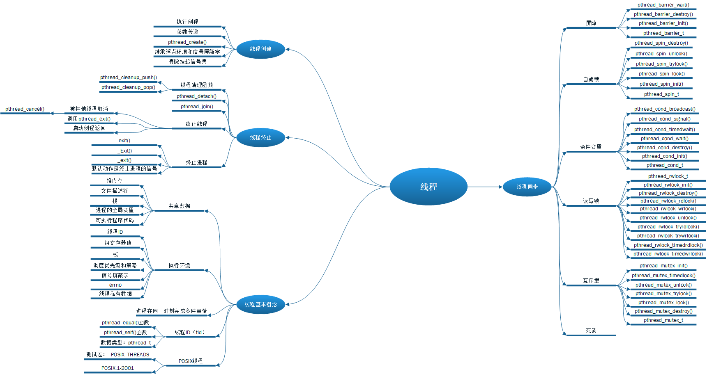

<h1 id=file_notes>
    第11章 线程
</h1>

[章节目录](../../README.md#title_ch11 "返回章节目录")
[函数表](func.md "进入函数表")

---



<h2 id=ch_11.2>
    线程概念
</h2>

* 典型的UNIX进程可以看做只有一个控制线程。
* 多个控制线程可以使进程在同一时刻完成多件事情。

引入线程的优点：
* 简化处理异步事件的代码。
* 进程之间的共享非常复杂，而线程之间可以自动共享某些数据。
* 提供整个程序的吞吐量。
* 改善响应时间。

注意：多线程与多处理器/多核没有必然的联系，单核处理器也可以提供多线程。

线程执行环境所必须的信息：
* 线程ID
* 一组寄存器值
* 栈
* 调度优先级和策略
* 信号屏蔽字
* errno变量
* 线程私有数据

进程的所有信息对该进程的所有线程都是共享的，包括
* 可执行程序代码
* 程序的全局变量
* 堆内存
* 栈
* 文件描述符

线程接口
* 也称为`pthread`，或`POSIX线程`
* 测试宏：_POSIX_THREAD

<h2 id=ch_11.3>
    线程标识
</h2>

线程ID：tid
* 只在线程所属进程的上下文中才有意义。
* 数据类型：`pthread_t`
* `pthread_t`可能是结构，或者是整数，取决于实现。
* 没有一种可移植的方式打印线程ID。

```c
int pthread_equal(pthread_t tid1, pthread_t tid2);
功能：比较两个线程ID是否相等。
头文件：pthread.h
返回值：相等返回非0数值，否则返回0。

pthread_t pthread_self(void);
功能：获取自身的线程ID。
头文件：pthread.h
返回值：调用线程的线程ID。
```

<h2 id=ch_11.4>
    线程创建
</h2>

在创建多个线程之前，程序的行为与传统的进程并没有什么区别。

```c
int pthread_create(pthrad_t *tidp,
                   const pthreat_attr_t *attr,
                   void *(*start_rtn)(void*), 
                   void *arg);
功能：创建一个新的线程。
头文件：pthread.h
返回值：成功返回0，出错返回错误编号。
形参说明：
    tidp: 新创建线程的线程ID（成功返回时）。
    attr：设置线程各种不同的属性。如果为NULL，则属性去默认值。
    start_rtn：线程运行的函数，此函数只有一个无类型指针参数。
    arg：传递给线程运行函数的参数。
```

注：
* 如果需要传递一个以上的参数，需要将参数放入到一个结构中。
* 新创建线程和现有线程的运行顺序是不确定的。
* 新线程会继承调用线程的浮点环境和信号屏蔽字，但挂起信号集会被清除。
* 每个线程都会提供errno的副本，与使用errno的现有函数兼容。
* pthread函数在调用失败时通常返回errno。
* Linux2.4使用单独的进程实现每个线程，很难与POSIX线程的行为匹配。
* Linux2.6使用Native POSIX线程库（NPTL），支持单进程中有多个线程的模型。


<h2 id=ch_11.5>
    线程终止
</h2>

与进程终止的关系：
* 进程中的任意线程调用了exit、_Exit、_exit，则整个进程终止。
* 如果信号的默认动作是终止进程，则发送到线程的信号会终止进程。

单个线程在不终止进程的情况下退出：
* 从启动例程返回，返回值是线程的退出码。
* 被同一进程的其他线程取消。
* 调用pthread_exit。

```c
void pthread_exit(void *rval_ptr);
头文件：pthread.h
功能：终止线程的控制流。

void pthread_join(void **rval_ptr);
功能：获取指定线程的返回值，或传递给pthread_exit的参数。
返回值：成功返回0，出错返回错误编号。
rval_ptr：可以为空，这样只等待指定线程退出，不获取进程的终止状态。
```

注：
* pthread_join会让调用进程阻塞，知道指定进程退出或被取消。
* 如果线程被取消，rval_ptr指定的内存单位被设置为PTHREAD_CANCELED。
* pthread_exit传递一个复杂的结构体，要保证函数返回后结构体所用内存依旧有效。
> 可以使用malloc或全局变量来保证内存依旧有效。

```c
int pthread_cancel(pthread_t tid);
功能：请求取消同一进程中的其他线程。并不等待线程终止，仅仅提出请求。
返回值：成功返回0，出错返回错误编号。
等同于pthread_exit(tid, (void*)PTHREAD_CANCELED);
```

```c
void pthread_cleanup_push(void (*rtn)(void*), void *arg);
功能：注册线程清理处理程序，可以注册多个。执行顺序与注册顺序相反。

void pthread_cleanup_pop(int execute);
功能：删除上次pthread_cleanup_push建立的清理处理程序。
     如果execute为0，则清理处理程序不被调用。
```

注：
* 清理处理程序调用的时机：
  * 调用pthread_exit时
  * 响应取消请求时
  * 用非0参数调用pthread_cleanup_pop时
* 这两个函数可能实现为宏，所以必须在与线程相同的作用域中以匹配对的形式使用。

```c
int pthread_detach(pthread_t tid);
功能：分离线程，使线程处于分离状态。
返回值：成功返回0，出错返回-1。

通常情况下，线程的终止状态会保存直到对该线程调用pthread_join。
分离状态下，线程终止时会立即回收线程的底层存储资源。
分离状态下对线程调用pthread_join的行为是未定义的。
```

进程控制原语与线程控制原语的比较：

<table>
    <tr><th>进程原语</th><th>线程原语</th><th>描述</th></tr>
    <tr>
        <td>fork</td>
        <td>pthread_create</td>
        <td>创建新的控制流</td>
    </tr>
    <tr>
        <td>exit</td>
        <td>pthread_exit</td>
        <td>从现有的控制流退出</td>
    </tr>
    <tr>
        <td>waitpid</td>
        <td>pthread_join</td>
        <td>从控制流中得到退出状态</td>
    </tr>
    <tr>
        <td>atexit</td>
        <td>pthread_cleanup_push</td>
        <td>注册在退出控制流时调用的函数</td>
    </tr>
    <tr>
        <td>getpid</td>
        <td>pthread_self</td>
        <td>获取控制流的ID</td>
    </tr>
    <tr>
        <td>abort</td>
        <td>pthread_cancel</td>
        <td>请求控制流的非正常退出</td>
    </tr>
</table>

<h2 id=ch_11.6>
    线程同步
</h2>

当多个控制线程共享同样的内存时，需要同步，确保每个线程看到一致的数据视图。
* 一个线程修改变量，其他线程同时读取或修改时。
  * 当变量修改需要多于一个存储器访问周期时，如果读、写周期交叉，就有可能出现数据不一致。
* 修改某一个值，并基于新的值做出某些决定。
  * 修改和判断并非原子操作。
* 如果数据总是以`顺序一致`出现的，就不需要额外的同步。
  * 顺序一致：当多个线程观察不到数据的不一致时，那么操作就是顺序一致的。

线程同步的方式：
* [互斥量](#mutex)
* [读写锁](#rwlock)
* [条件变量](#cond)
* [自旋锁](#spin)
* [屏障](#barrier)

<h3 id=mutex>
    互斥量
</h3>

`互斥量`本质上是一把锁
* 在访问数据前对互斥量进行加锁，访问结束后解锁。
* 互斥量加锁之后，试图再次加锁的线程会被阻塞，直到互斥量解锁，并成功加锁。
* 同一时刻只有一个线程可以对互斥量成功加锁。
* 所有线程的数据访问模式都设计成一样的（访问前加锁，访问后解锁），互斥机制才能正常工作。

数据类型：pthread_mutex_t

互斥量原语：

```c
int pthread_mutex_init(pthread_mutex_t *mutex, pthread_mutexattr_t *attr);
功能：初始化信号量。如果是静态分配，也可以设置为常量PTHREAD_MUTEX_INITIALIZER。
      如果attr为空，则初始化为默认属性。

int pthread_mutex_destrory(pthread_mutex_t *mutex);
功能：销毁信号量。如果信号量是动态分配的，在释放内存之前，需要调用此函数。

int pthread_mutex_unlock(pthread_mutex_t *mutex);
功能：对互斥解锁。

int pthred_mutex_lock(pthread_mutex_t *mutex);
功能：对互斥量加锁，如果互斥量已经加锁，则调用线程将被阻塞到互斥量被解锁。

int pthread_mutex_trylock(pthread_mutex_t *mutex);
功能：尝试对互斥量加锁。如果加锁失败，则不阻塞进程，返回EBUSY。

int pthread_mutex_timedlock(pthread_mutex_t *mutex, const struct timespec *tsptr);
功能：对互斥量加锁，如果在指定的时间之前还没有加锁成功，则返回ETIMEOUT。
     tsptr指定愿意等待的绝对时间。
```

死锁产生的条件：
* 互斥：资源只能被一个进（线）程占有。
* 不可剥夺：资源只能主动释放。
* 请求与保持：进（线）程已经占有了资源，但又提出了新的资源请求。
* 循环等待：进（线）程占有的资源被其他进（线）程请求。

互斥量可能造成死锁的情况：
* 线程对互斥量加锁两次。
* 线程A占有互斥量1，并请求处于加锁状态的互斥量2。线程B占有互斥量2，并请求互斥量1。

避免死锁的方法：
* 仔细控制互斥量加锁的顺序。
  * 例如需要两个互斥量时，总是以相同的顺序加锁。
  * 如果程序的结构比较复杂，这种方法就比较困难。
* 使用trylock。如果无法加锁成功，则释放已占有的锁，过一段时间再试。

在多线程软件设计时，在满足锁需求的情况下，在复杂性和性能之间找到平衡
* 锁的粒度太粗，会出现很多线程阻塞等待相同的锁，不能改善并发性。
* 锁的粒度太细，过多的锁开销会使系统性能受到影响。

<h3 id=rwlock>
    读写锁
</h3>

读写锁与互斥量类似，适用于读远大于写的情况。有三种状态：写加锁、读加锁、不加锁
* 一次只有一个线程可以占有写模式的读写锁。
  * 写加锁状态时，所有试图加锁的线程都会被阻塞，直到写锁被释放。
* 多个线程可以同时占有读模式的读写锁。
  * 读加锁状态时，读模式进行加锁的线程可以得到访问。写模式加锁的线程会被阻塞，直到所有的读锁释放。
* 处于读模式状态时，某个线程试图以写模式加锁，系统**可能**会阻塞后续的读模式加锁，避免写模式请求一直得不到响应。

读写锁也叫做共享互斥锁
* `读模式`可以说成`共享模式`
* `写模式`可以说成`互斥模式`

数据类型：pthread_rwlock_t

读写锁原语：

```c
int pthread_rwlock_init(pthread_rwlock_t *rwlock,
                        const pthread_rwlockattr_t *attr);
功能：初始化读写锁，在使用读写锁之前，必须初始化。
      如果是静态分配，可以使用常量PTHREAD_RWLOCK_INITIALIZER初始化。
      attr填NULL表示使用默认的属性。

int pthread_rwlock_destroy(pthread_rwlock_t *rwlock);
功能：销毁读写锁。如果读写锁是动态分配的，在释放内存之前，必须调用此函数。

int pthread_rwlock_unlock(pthread_rwlock_t *rwlock);
功能：释放读写锁，无论是读模式加锁还是写模式加锁。

int pthread_rwlock_rdlock(pthread_rwlock_t *rwlock);
功能：读模式下加锁。
注意：实现可能会限制读锁的共享次数。

int pthread_rwlock_wrlock(pthread_rwlock_t *rwlock);
功能：写模式下加锁。

/* 条件版本 */
int pthread_rwlock_tryrdlock(pthread_rwlock_t *rwlock);
int pthread_rwlock_trywrlock(pthread_rwlock_t *rwlock);
功能：尝试获取锁，获取失败则返回EBUSY，不会阻塞线程。

/* 超时版本 */
int pthread_rwlock_timedrdlock(pthread_rwlock_t *rwlock,
                               const struct timespec *tsptr);
int pthread_rwlock_timedwrlock(pthread_rwlock_t *rwlock,
                               const struct timespec *tsptr);
功能：超过指定时间还没有获取到锁，则返回ETIMEOUT。
注意：tsptr指定的是绝对时间，而不是相对时间。
```

<h3 id=cond>
    条件变量
</h3>

条件变量允许线程以无竞争的方式等待特定的条件发生。工作原理如下：
* 进入等待条件之前，必须先获取互斥量；进程进入睡眠之后释放互斥量。
* 通知条件发生之前，必须先获取互斥量；通知完毕之后释放互斥量。

通过互斥量对条件的保护，关闭了条件检查和线程进入休眠状态等待条件改变这两个操作之间的时间通道。

数据类型：pthread_cond_t

条件变量原语：

```c
int pthread_cond_init(pthread_cond_t *cond, const pthread_condattr_t *attr);
功能：初始化条件变量。如果是静态分配，可以使用PTHREAD_COND_INITIALIZER初始化。
      attr为NULL表示使用默认属性。

int pthread_cond_destroy(pthread_cond_t *cond);
功能：销毁条件变量。

/* 等待条件变量 */
/* 在调用之前，必须锁住互斥量。线程睡眠之后会释放信号量。 */
/* 返回之后，互斥量会再次被锁住。 */
int pthread_cond_wait(pthread_cond_t *cond, pthread_mutex_t *mutex);
功能：等待条件变量变为真。

int pthread_cond_timedwait(pthread_cond_t *cond, pthread_mutex_t *mutex,
                           const struct timespec *tsptr);
功能：在指定的时间内等待条件变量变为真。如果超时，返回ETIMEOUT。
      tsptr指定一个绝对时间，而不是相对时间。

/* 通知条件发生 */
int pthread_cond_signal(pthread_cond_t *cond);
功能：通知线程条件已经满足，至少能唤醒一个等待该条件的线程。

int pthread_cond_broadcast(pthread_cond_t *cond);
功能：唤醒等待该条件的所有的进程。
```

<h3 id=spin>
    自旋锁
</h3>

通过忙等使线程处于阻塞的状态，适用于锁被持有的时间短、不希望在重新调度上花费太多的成本。

自旋锁适用于非抢占式的调度算法。

数据类型：pthread_spinlock_t

自旋锁原语：

```c
int phtread_spin_init(pthread_spinlock_t *lock, int phared);
功能：初始化自旋锁。pshared表示进程共享属性。
      PTHREAD_PROCESS_SHARED  自旋锁可以被属于不同进程的线程获取
      PTHREAD_PROCESS_PRIVATE 自旋锁只能被属于同一个进程的线程获取

int pthread_spin_destroy(pthread_spinlock_t *lock);
功能：销毁自旋锁。

int pthread_spin_lock(pthread_spinlock_t *lock);
功能：锁定自旋锁。
      线程在锁定自旋锁的情况下调用此函数，其行为是未定义的。
      可能永久自旋，也有可能返回EDEADLK。

int pthread_spin_trylock(pthread_spinlock_t *lock);
功能：尝试锁定自旋锁。如果不能锁定，立即返回EBUSY。

int pthread_spin_unlock(pthread_spinlock_t *lock);
功能：解锁自旋锁。
      如果对未锁定的自旋锁调用此接口，其行为是未定义的。
```

<h3 id=barrier>
    屏障
</h3>

是用户协调多个线程并行工作的同步机制。屏障允许每个线程等待，知道所有的合作线程都到达某一点，然后从该点继续执行。

数据类型：pthread_barrier_t

屏障原语：

```c
int pthread_barrier_init(pthread_barrier_t *barrier,
                         const pthread_barrierattr_t *attr,
                         unsigned int count);
功能：初始化屏障，attr指定屏障的属性，如果为NULL表示使用默认属性。
      count表示在所有线程继续运行之前，必须到达屏障的线程数目。

int pthread_barrier_destroy(pthread_barrier_t *barrier);
功能：反初始化屏障。

int pthread_barrier_wait(pthread_brrier_t *barrier);
功能：线程已完成工作，等待其他线程到达。
     最后一个线程调用此函数，就满足了屏障计数，所有的线程都被唤醒。
      如果返回PTHREAD_BARRIER_SERIAL_THREAD表示可以作为主线程。

      到达了屏障计数值之后，屏障可以被重用。
```

---

[章节目录](../../README.md#title_ch11 "返回章节目录")
[函数表](func.md "进入函数表")